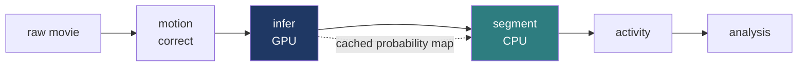

# OrCaNN

Finds every cell in a microscope video of lab-grown brain tissue, measures when each one fires, and compares mutant tissue against control.

Everything below is one real recording: **`D98_0-3_050226_R1`**, 601 frames at 2 Hz, five minutes of a day-98 organoid.

---

## The pipeline



Five restartable stages. The GPU step runs once and its output is cached, so retuning the detection threshold costs nothing.

---

## 1 · Where are the cells?


*Soma probability, one value per pixel.* A learnable Laplacian-of-Gaussian filter bank runs on every frame; the response is pooled into four temporal moments (mean, robust max, variance, coherence); a small U-Net turns that stack into probability. The variance channel is zero-mean by construction, which is what subtracts the out-of-focus haze that defeats tools built for two-photon microscopy.


**279 cells.** Threshold the cached map, split touching cells with a centroid-seeded watershed. This overlay is the quality check: one glance, one verdict.

---

## 2 · When does each cell fire?


**Twelve population-wide transients**, every 13 to 16 seconds, fading across the recording.

| | |
|---|---|
| Cells detected | 279 |
| Cells carrying signal | 128 |
| Cells joining ≥ 6 of the 12 transients | 75 |
| Cells passing the event gate | 11 |
| Events called | 45 |

The distance between 75 and 11 is the honest headline of this stage. At 2 Hz an event is only a few frames wide, so the gate is strict on purpose: a minimum amplitude, a noise floor measured on each individual trace, and a minimum duration in real seconds. It buys precision and pays in recall. The raster shows exactly what the gate is leaving on the table.

---

## 3 · What the diagnostics say


*Whole-field mean fluorescence.* Two features, opposite meanings.

**The slow decline** from 490 to 456 is photobleaching. The rolling baseline absorbs it.

**The twelve sharp transients** are the network. Fast rise, slow decay, regular interval, and 75 of 279 cells rise with them. A light-source glitch does not do that.

The red annotation is the diagnostic's automatic call: *step at frame 22*. It is the onset of the first transient, and it is a **false positive**. That is the design. The module measures, flags, and writes the numbers to `run_info.json`. A human adjudicates. It corrects nothing, because the artefact it screens for (a whole-field intensity step, landing on every cell at once and reading as network synchrony) is indistinguishable from the finding itself, and silently subtracting it would destroy the result it exists to protect.

---

## 4 · Compare

Group analysis pools every recording, gates on motion and drift, deduplicates cells, computes event rate, amplitude, pairwise correlation, synchrony and active fraction per recording, then compares genotype and developmental day.

One rule holds the statistics up: **the organoid line is the experimental unit**, not the recording. Four recordings of one organoid are one sample.

> *(group comparison figure to go here)*

---

## Limits

- Absolute event rate on Fluo-4 is **uncalibrated**. Compare relatively.
- Detection is validated against **manual annotation**, not a public benchmark. None exists for this modality.
- **No sub-frame timing** at 2 Hz. Durations are characteristic timescales: faithful in order, indicative in seconds.
- **Neuropil correction is off.** Its geometric assumptions do not hold in an organoid.
- The event gate is **weighted towards precision**. See the 75-versus-11 gap above.

---

## Run

```bash
source hpc/config.sh
bash hpc/submit.sh motion_correct config.yaml
bash hpc/submit.sh infer          config.yaml
bash hpc/submit.sh segment        config.yaml
bash hpc/submit.sh activity       config.yaml
qsub -v CONFIG=config.yaml hpc/jobs/analysis.sh
```

One YAML file holds every path, model and threshold. `orcann train_spatial --synthetic` self-tests with no data and no GPU.

Full setup: [`README.md`](README.md) · [`hpc/README_HPC.md`](hpc/README_HPC.md)
