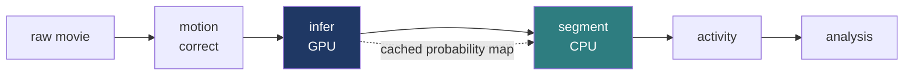

# OrCaNN

Finds every cell in a microscope video of lab-grown brain tissue, measures when each one fires, and compares mutant tissue against control.

Aquiring more training data is a top priority for this project

Everything below is one real recording, 601 frames at 2 Hz, five minutes of a day-98 organoid.

---

## The pipeline



Five restartable stages. The GPU step runs once and its output is cached, so retuning the detection threshold costs nothing.

---

## 1 · Where are the cells?


*Soma probability, one value per pixel.* A learnable Laplacian-of-Gaussian filter bank runs on every frame; the response is pooled into four temporal moments (mean, robust max, variance, coherence); a small U-Net turns that stack into probability. The variance channel is zero-mean by construction, which is what subtracts the out-of-focus haze that defeats tools built for two-photon microscopy.


**279 cells.** Threshold the cached map, split touching cells with a centroid-seeded watershed. This overlay is the quality check: one glance, one verdict.

---

## 2 · When does each cell fire?


---

## 3 · What the diagnostics say


*Whole-field mean fluorescence.* Two features, opposite meanings.

**The slow decline** from 490 to 456 is photobleaching. The rolling baseline absorbs it.

**The twelve sharp transients** are the network. Fast rise, slow decay, regular interval.

The red annotation is the diagnostic's automatic call: *step at frame 22*. It is the onset of the first transient, and it is a **false positive**. That is the design. The module measures, flags, and writes the numbers to `run_info.json`. A human adjudicates. It corrects nothing, because the artefact it screens for (a whole-field intensity step, landing on every cell at once and reading as network synchrony) is indistinguishable from the finding itself.

---

## 4 · Compare

Group analysis pools every recording, gates on motion and drift, deduplicates cells, computes event rate, amplitude, pairwise correlation, synchrony and active fraction per recording, then compares genotype and developmental day.

One rule holds the statistics up: **the organoid line is the experimental unit**, not the recording. Four recordings of one organoid are one sample.


---

## Limits

- Absolute event rate on Fluo-4 is **uncalibrated**. Compare relatively.
- Detection is validated against **manual annotation**, not a public benchmark. None exists for this modality.
- **No sub-frame timing** at 2 Hz. Durations are characteristic timescales: faithful in order, indicative in seconds.
- **Neuropil correction is off.** Its geometric assumptions do not hold in an organoid.
- The event gate is **weighted towards precision**. 

---

## Run

```bash
source hpc/config.sh
bash hpc/submit.sh motion_correct config.yaml
bash hpc/submit.sh infer          config.yaml
bash hpc/submit.sh segment        config.yaml
bash hpc/submit.sh activity       config.yaml
qsub -v CONFIG=config.yaml hpc/jobs/analysis.sh
```

One YAML file holds every path, model and threshold. `orcann train_spatial --synthetic` self-tests with no data and no GPU.

Full setup: [`README.md`](README.md) · [`hpc/README_HPC.md`](hpc/README_HPC.md)
