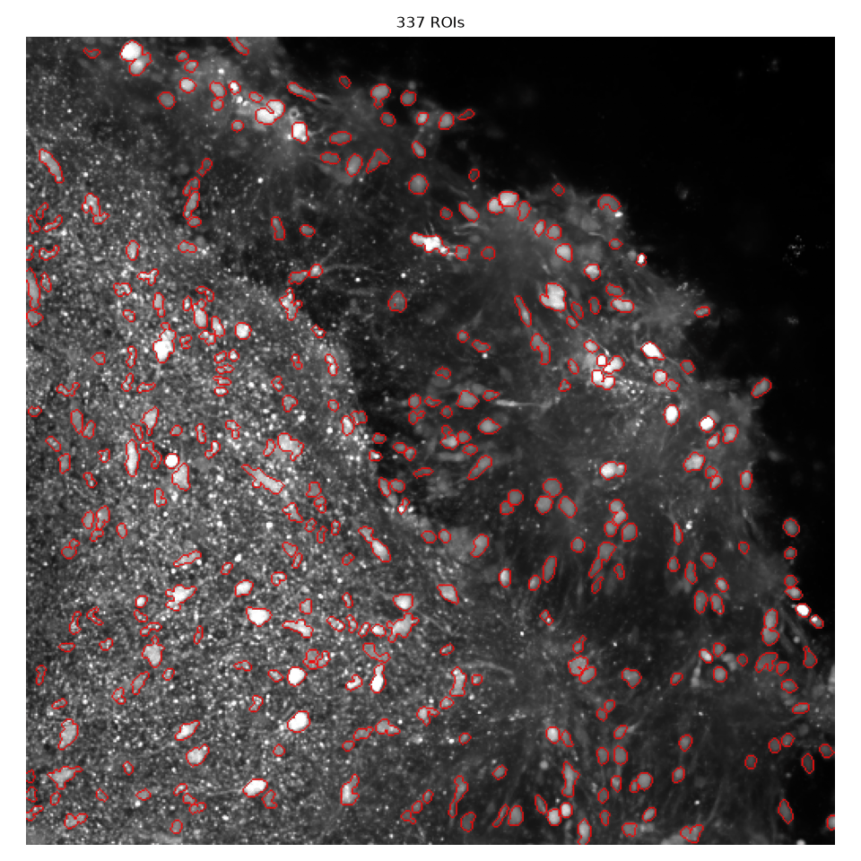
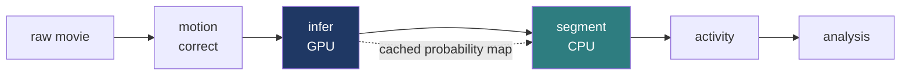
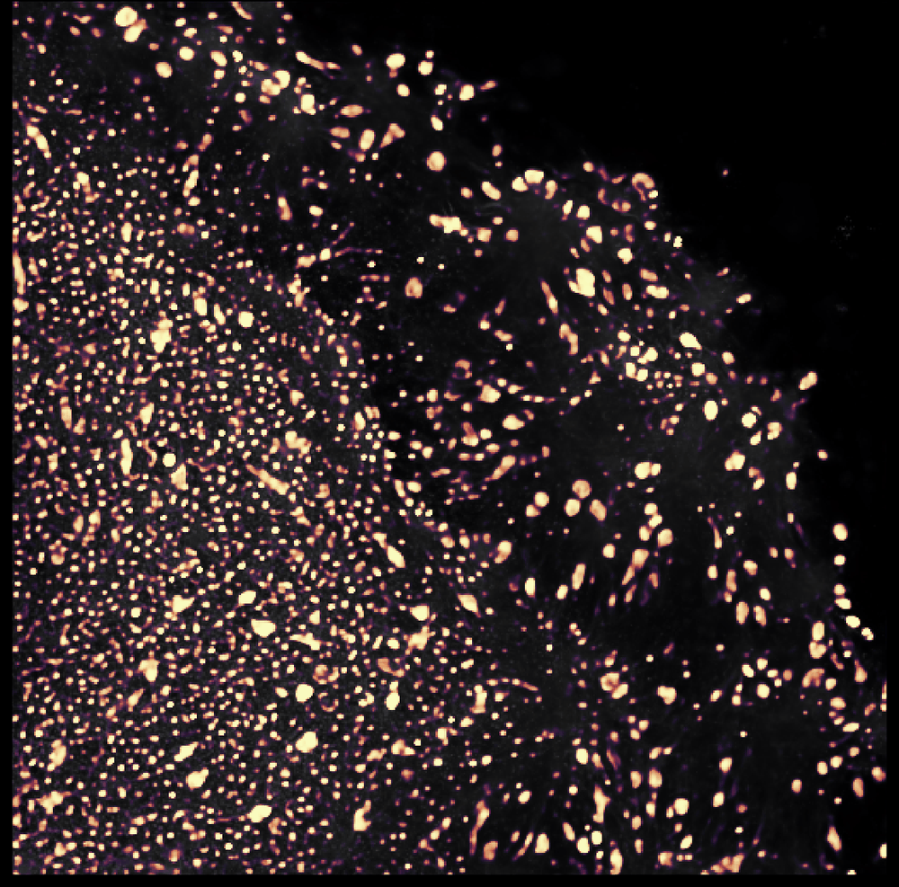
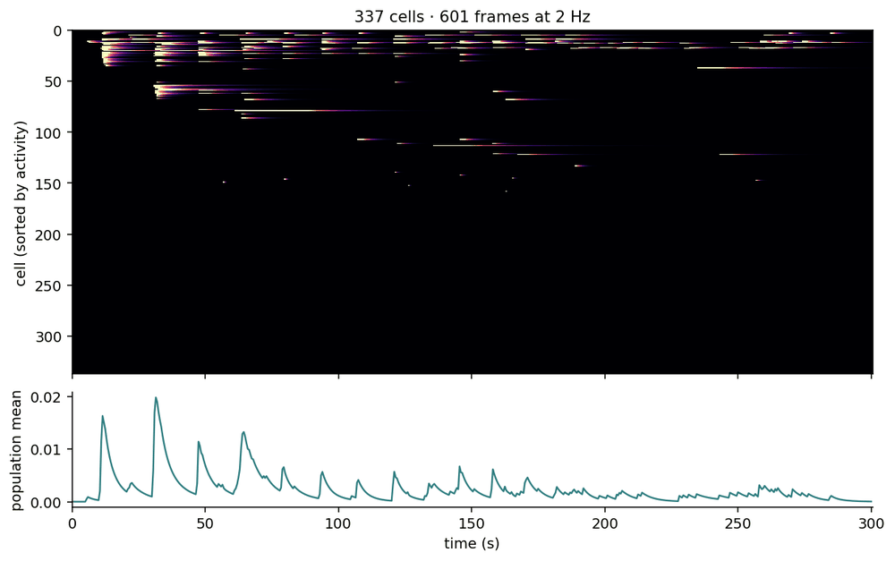
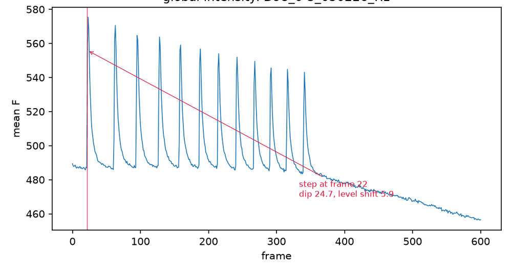

<h1 align="center">OrCaNN</h1>

<p align="center">
  Finds the cells in a microscope video of lab-grown brain tissue, measures when each one fires,<br/>
  and compares tissue carrying a mutation against healthy tissue.
</p>

<p align="center">
  <a href="#1--finding-the-cells">Detection</a> ·
  <a href="#2--measuring-activity">Activity</a> ·
  <a href="#3--diagnostics">Diagnostics</a> ·
  <a href="#install">Install</a> ·
  <a href="#run">Run</a> ·
  <a href="#limits">Limits</a>
</p>

<p align="center">
  
</p>

The figures on this page all come from a single five-minute recording (601 frames at 2 Hz), used as a worked example of what each stage produces.

Current models uses limited training data which cannot fully populate the network weights. Increasing the training data pool for organoid recordings is the top priority for this project.

---

## The pipeline



Five stages, each writing its output to disk so any stage can be re-run on its own. Inference is separated from segmentation so that the GPU model runs once and its output is cached; adjusting the detection threshold afterwards re-runs only the cheap step.

---

## 1 · Finding the cells



The first stage produces a **soma probability map**: for every pixel, the model's confidence that it lies inside a cell body.

The tissue is thick and fluoresces throughout its depth, so each cell sits in a haze of light coming from cells above and below it. Standard cell-finding tools assume the cleaner images produced by a two-photon microscope and do not cope well with that haze.

The model handles it in three steps. A bank of Laplacian-of-Gaussian filters, the classical operator for finding a bright round object, is applied to every frame. The responses are pooled over time into four summary channels (mean, robust maximum, variance and coherence); the variance channel has its mean removed by construction, which subtracts the static out-of-focus haze and leaves the cells. A small U-Net then converts those channels into probability.

Because the filter bank supplies most of the prior knowledge, the network has relatively little to learn, and can be trained from a handful of recordings annotated by hand. That matters here, since no public labelled dataset exists for this kind of image.

Thresholding the map, splitting touching cells with a watershed, and dropping anything below a minimum radius gives **337 cells** in this recording. The outline overlay above is the main quality check.

---

## 2 · Measuring activity



Each cell's fluorescence is converted to ΔF/F₀ against a rolling baseline, which absorbs the gradual dimming of the dye over the recording. Events are then inferred from each trace.

In this example the population shows twelve network-wide transients, roughly every 12 to 16 seconds, decreasing in size across the recording.

| | |
|---|---|
| Cells detected | 337 |
| Cells carrying signal | 182 |
| Cells joining ≥ 6 of the 12 transients | 121 |
| Cells passing the event gate | 61 |
| Events called | 206 |

At 2 Hz a calcium event spans only a few frames, so the event detector is constrained by three conditions: a minimum amplitude (`s_min = 0.15` ΔF/F₀), a noise floor measured on each trace individually, and a minimum duration in seconds, which excludes single-frame flickers. Here 61 of the 121 participating cells clear it. The gate favours precision over recall, and the raster is how that trade-off is checked.

---

## 3 · Diagnostics



Every recording gets a trace of the whole-field mean fluorescence. Two things are visible in it, and they mean different things.

The **slow decline** is photobleaching, the gradual loss of dye brightness. The rolling baseline accounts for it.

The **twelve sharp transients** are network activity: a fast rise, a slow decay, a regular interval, and 121 of the 337 cells rising along with them.

The value of this trace is that it also reveals a specific hazard. If the light source flickers or a frame is dropped, every pixel brightens at the same moment, and after baseline correction that appears on every cell trace at once, which the analysis would read as the whole network firing together. Since network synchrony is what the experiment measures, such an artefact is hard to distinguish from a real finding. The module therefore measures and flags candidate events and writes the numbers to `run_info.json` for a person to judge, rather than correcting them automatically. The red marker in the figure above is one such flag, and in this case it is a false positive: it sits on the onset of the first genuine transient.

---

## 4 · Comparing recordings

The final stage pools all recordings, excludes those failing quality checks on motion and drift, removes duplicate cells, and computes per-recording summaries: event rate, amplitude, pairwise correlation, synchrony and active fraction. These are then compared across genotype and developmental day.

The statistical unit is the **organoid line**, not the recording, since several recordings from one organoid are not independent samples.

---

## Outputs

```
results/infer/<rec>/      prob.npy  max_projection.npy  prob_overlay.png
results/spatial/<rec>/    labels.npy  centroids.npy  traces.npy  figures/overlay.png
results/activity/<rec>/   temporal_traces.npy   (ΔF/F₀)
                          traces_denoised.npy   spike_trains.npy
                          spatial_footprints.npz  deconv_noise.npy
                          run_info.json  gallery.html   (interactive per-cell viewer)
results/analysis/         analysis_results.json  dataset_features.csv
                          figures/  (genotype comparison, correlation, activity, overview)
```

Row `i` of every per-recording array corresponds to label `i+1` in `labels` and centroid `i` in `centroids`.

---

## Install

Two conda environments, kept separate so that a pinned numerical stack does not constrain PyTorch.

```bash
bash hpc/setup.sh all          # SGE cluster: builds both environments, safe to re-run
pip install -e ".[torch]"      # locally: every stage except OASIS deconvolution
```

---

## Run

```bash
source hpc/config.sh
bash hpc/submit.sh motion_correct config.yaml
bash hpc/submit.sh infer          config.yaml
bash hpc/submit.sh segment        config.yaml
bash hpc/submit.sh activity       config.yaml
qsub -v CONFIG=config.yaml hpc/jobs/analysis.sh
```

Paths, model and thresholds are all set in one YAML file. Every stage also runs locally, and `orcann train_spatial --synthetic` self-tests with no data and no GPU. Cluster details: [`hpc/README_HPC.md`](hpc/README_HPC.md).

---

## Limits

- The absolute event rate on Fluo-4 is **uncalibrated**; comparisons should be relative.
- Detection is validated against **manual annotation**, not a public benchmark, as none exists for this modality.
- **Timing finer than one frame is not recoverable** at 2 Hz. Reported durations are characteristic timescales, reliable in their ordering rather than in absolute seconds.
- The **event gate favours precision**: in the example above, 61 cells clear it out of the 121 that visibly participate.
- Genotype and developmental day are **parsed from the recording filename**; check `dataset_features.csv` after a first run.

---

## References

Lindeberg, *IJCV* 1998 (LoG blob detection) · Pnevmatikakis & Giovannucci, *J. Neurosci. Methods* 2017 (NoRMCorre) · Friedrich et al., *PLoS Comp Biol* 2017 (OASIS)
