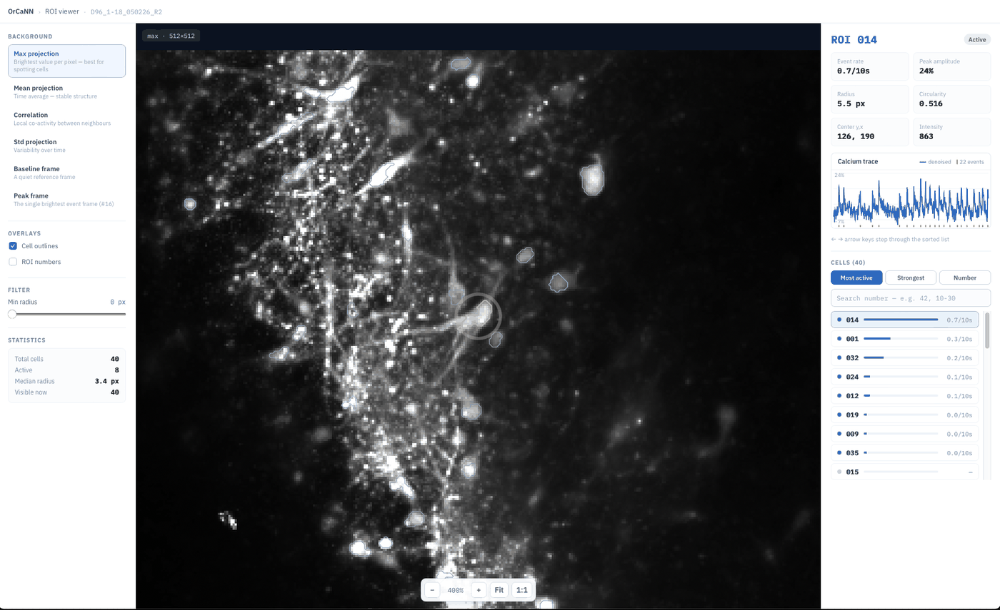
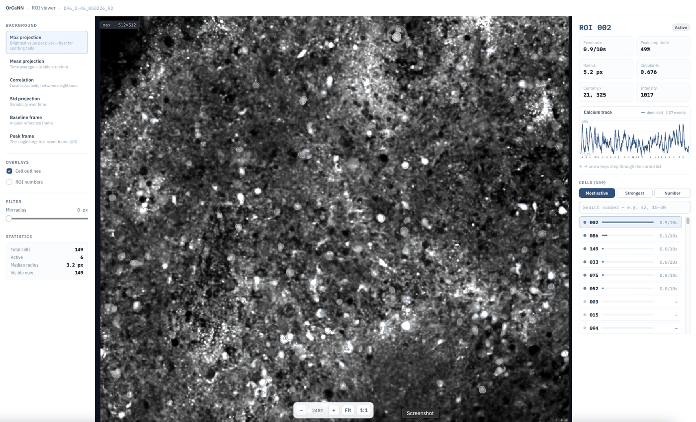

# OrCaNN

Calcium imaging analysis pipeline for brain organoids.

Trained and tested on 2Hz data with the fluo-4 indicator. (See acknowledgements)

---

## 1 · What it does
[1 · What it does](#1--what-it-does) ·
[2 · Motion correction, traceability & quality control](#2--motion-correction-traceability--quality-control) ·
[3 · Machine learning inference & segmentation](#3--machine-learning-inference--segmentation) ·
[4 · Activity trace extraction & transient detection](#4--activity-trace-extraction--transient-detection) ·
[5 · Analysis](#5--analysis) ·
[Usage](#usage)

Parallel job submission on HPC:

- motion correction, traceability & quality control
- machine learning inference stage produces soma probability map
- segmentation derives cell boundaries from chosen probability threshold
- activity trace extraction and transient detection
- statistical analysis and diagnostics across genotype, time and whole data

config.yaml provides single location for every relevant parameter
 
All data is retained for exploratory analysis and reproducibility

---

## 2 · Motion correction, traceability & quality control

NoRMCorre motion correction ([Pnevmatikakis & Giovannucci 2017](https://doi.org/10.1016/j.jneumeth.2017.07.031)) with shift data retained for excess motion exclusion, controllable in config.

Every stage writes into a folder named for the stage and the run key -
`<stage>_outputs_<key>` - so a result is found by the name of the experiment that
made it. `run.key` in config names the run; re-running a key overwrites it.

Beside each output is a record of the settings it was made under, plus a link to
the record of the stage above. A stage recomputes only the recordings whose
settings have moved, so changing the segmentation threshold re-runs segment,
activity and analysis and leaves the GPU stage alone. The settings a stage is
keyed on exclude the run key, so an earlier run's output made under the same
settings is reused.

The chain is keyed on what changes the output: infer is keyed on
the model's content digest, since `models.spatial: latest`
resolves to a different model over time.

    orcann status --config config.yaml     what is current
    orcann runs   --config config.yaml     which run keys exist, and how far each got

*Outputs*
```
OrCaNN/data/pre_processed/motion_correction_outputs_<key>/:
    <recording_name>.json
    <recording_name>_shifts.npy
    <recording_name>.tif
```

---

## 3 · Machine learning inference & segmentation

Analytical head feeding a U-Net for per-pixel soma probability.


<video src="docs/img/training_progress.mp4" controls muted loop width="512"></video>

Separation of adjacent cells relies on a reduced probability boundary between them and is controlled by the spatial detection threshold in config (0.3 default is conservative). 

*Outputs*

```
OrCaNN/results/infer/infer_outputs_<key>/:
    <recording_name>/:
        max_projection.npy
        meta.json
        prob.npy
        prob_overlay.png
```


```
OrCaNN/results/spatial/segment_outputs_<key>/:
    <recording_name>/data/:
        centroids.npy
        labels.npy
        max_projection.npy
        meta.json
        traces.npy
    <recording_name>/figures/:
        overlay.png            # Segmentation overlay, output controlled in config
```


---

## 4 · Activity trace extraction & transient detection

Segmented ROIs passed to activity for trace extraction and transient detection

Supports OASIS ([Friedrich, Zhou & Paninski 2017](https://doi.org/10.1371/journal.pcbi.1005423)) transient detection or 'robust' method for low acquisition rate data

*Outputs*

```
OrCaNN/results/activity/activity_outputs_<key>/:
    <recording_name>/:
        gallery.html                        # Interactive viewer for diagnostics and verification, highly compressed to minimize data load
        global_intensity.png
        run_info.json

        data/:
            deconv_censored.npy
            deconv_noise.npy
            max_projection.npy
            mean_projection.npy
            motion_shifts.npy
            spatial_footprints.npz
            spike_trains.npy
            temporal_traces.npy
            temporal_traces_raw.npy
            traces_denoised.npy
```

Every ROI is inspectable against six background projections, with its own metrics,
calcium trace and event count, and a cell list sortable by activity. Two recordings
from the same day - one sparse, one dense:





---
## 5 · Analysis

Statistical analysis module - all data it uses comes from the exposed outputs of previous stages

Provides:

- Selected traces
- Full overview
- Activity analysis
- Genotype comparisons
- Diagnostics and metrics

See analysis documentation for more detail


---

## Usage

1. Clone the package locally, then put it on the cluster. Wherever it lands is
   the workspace - there is no separate `src/` copy and no tree to build:

    ```bash
    git clone <repo-url> OrCaNN
    rsync -av --exclude .git OrCaNN/ <user>@eddie.ecdf.ed.ac.uk:/exports/eddie/scratch/<user>/OrCaNN/
    ```

2. One time HPC environment setup, on a login node:

    ```bash
    cd /exports/eddie/scratch/<user>/OrCaNN
    source hpc/config.sh    # edit conda-env / module names first if needed
    bash   hpc/setup.sh     # builds both envs: torch, and caiman for motion correction + activity
    ```

3. Upload data to OrCaNN/data/raw/

4. Check the config meets your requirements:
    Frame rate is the only mandatory check, transient detection settings are most dependant on frame rate

5. Submit the whole pipeline from a login node. It asks the pipeline what is
   already there, submits only the stages with work to do, and chains them so
   each starts when the one above it finishes:

    ```bash
    bash hpc/run_all.sh --dry-run    # print the plan without queueing anything
    bash hpc/run_all.sh              # motion correction -> infer -> segment -> activity -> analysis
    ```

   `--key NAME` names the run's outputs; `run.notify_email` in config is mailed
   when the last stage ends.


## License

MIT - see [LICENSE](LICENSE).

---

## acknowledgements

Created in collaboration with:

- Theil lab, University of Edinburgh
- Chun Lim, University of Edinburgh - Provided the manually annotated training data for the available model
